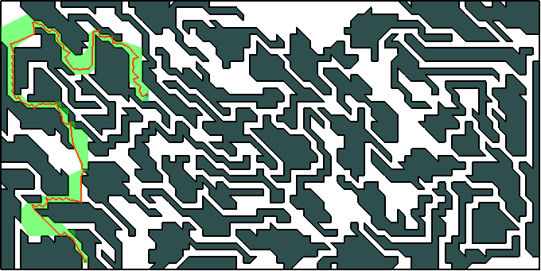

# PathSearch

## About (generator branch)
Here a collection of [path/motion planning](https://en.wikipedia.org/wiki/Motion_planning) algortihms are implemeneted. This is a course project where each student was supposed to work on a specific motion planning method. The statement of the problem ran as follows

> Given a polygon with polygon "holes" find a shortest path between any two given points.
> For instance:

## Structure
At first a naive yet stable version of a Delaunay triangulation was implemented. That was used both in an obstacle generator, which was the main initial goal of the work. Voronoi diagramm motion planning algorithm was developed. It approximates the full-blown generalised Voronoi diagramm of the obstacles with VD of only their vertices which is most of the time enough for paths that are somewhere near the precise path.
 

Then with any decent implementation of a broadth-first or A\* search algorithm one can obtain shortest path from any point to any other. Path will follow the obstacles sides, which makes sense, since agent's size is set to zero. 
Although when an object has a non-zero size, we can use the very same technique to provide a path for it in the same circumstances. And for that purpose we use Voronoi diagram, like this:

Here's another example of an area with obstacles, much bigger than the previous and it also looks more labyrinthine.

The main course of of work in this project was dedicated to proper obstacle generation. The thing is that most generators use a comparatively simple logic to build obstacles. They merely generate star shaped polygons and scatter them around a given area. Furthermore the obstacles better not intersect since there is a lot of motion planning algorithms out there and the admissibility of intersecting obstacles can be argued, some of algorithms are not tolerant to something like this:

The obstacle generator developed in this project uses a Delaunay triangulation of some (preferably dense) set of points that can be scattered or organised in a nice grid. Based on the triangulation algorithm "grows" a set of areas made of triangles. Those areas never intersect each other and can be set up to be very long and unpredictable or very compact and close to a convex polygon. All examples above were generated with the developed program. 
Here we can see what will happen of we use homogeneous grid instead of the scattered set.

And here we make obstacles a little more compact, broadth-first rather than depth first, so to say.

## Kirkpatrick's optimal search in planar graphs (master branch)
In Delaunay triangulation as well as in many existing computational geometry algorithms there often arises a problem of a fast point location. When given a planar subdivision, say a triangulation, one may want to know for a certain point to which face (triangle) does it belong. Linear search involves trying all faces one by one until we find the face that includes a given point.
In 1981 David Kirkpatrick has published a paper that is called "Optimal Search in Planar Subdivisions" which treats this problem in a very comprehensive way. When applying the technique to Delaunay triangulation it is usually recommended to follow the approach when all editing procedures performed on the triangulation (say, adding a new vertex) are "logged" to be remembered in a tree. The picture below sheds some light on this idea:

Thus if we start with a single big triangle that includes all points that are going to be processed then for each point we will have to first split triangle that includes it into three and maybe swap some edges while reestablishing "delaunayhood" of the triangles. Every operation here is reflected in **history graph** where every node is triangle that has ever existed in the subdivision and its "children" are the triangles that replaced it. 

This implementation made it possible to investigate efficiency of such technique in practice. The research has shown that points are to be added in random order to achieve best performance, while adding a group of closely spaced points produces high density areas which make the history graph to be more deep than broad. The following pictures show how the graph might look in all the different cases.

Here's what happens if you add vertices of a circle in their natural order.

Here the vertices of a circle are shuffled first.
